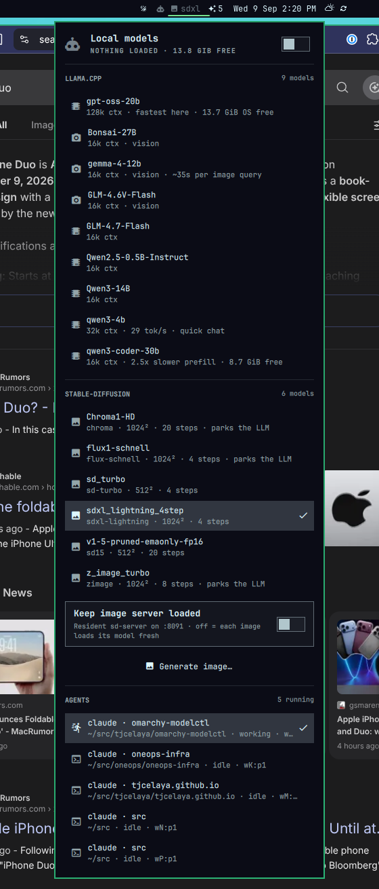

# modelctl

An Omarchy bar plugin for running local LLMs with llama.cpp, and for seeing every
running [herdr](https://github.com/tjcelaya/herdr) coding agent at a glance.

    󰚩oss20  󰋩  󱃒2

- **Model** (`󰚩` + abbreviation) — left-click for the model menu, middle-click stops
  the server, right-click tails its journal.
- **Images** (`󰋩`) — left-click (tag = selected model) generates one image with the model selected in the
  menu's `stable-diffusion` section; right-click toggles a resident SD-Turbo
  `sd-server` on :8091. Dim = one-shot, bright = resident.
- **Agents** (`󱃒` + count; glyph via the `agentsIcon` setting) — click opens the
  agents submenu directly, which lists every running herdr
  agent with its cwd and status. Selecting one focuses its pane.

Names, paths and status live in the menu; the bar stays to icons and short tags.

### Image generation

Prompts via Omarchy's native input popup, saves to `~/Pictures/generated` as
`<timestamp>-<prompt-slug>.png`, then opens it. Override the folder with
`MODELCTL_IMAGE_DIR` or the `imageDir` setting; `SD_STEPS`, `SD_W`, `SD_H` tune the rest.

Models (`modelctl-image --list`; pick in the menu or `modelctl-image --<id> "prompt"`).
Measured 2026-08-26 at native res on the 23,552 MiB pool, `--vae-tiling` on:

| id | model | res | steps | wall | peak GPU | beside gpt-oss-20b (~14.4 GiB)? |
|---|---|---|---|---|---|---|
| `turbo` | SD-Turbo | 512² | 4 | ~9 s | ~4.5 GiB | yes |
| `sd15` | SD 1.5 | 512² | 20 | ~32 s | ~4 GiB | yes |
| `sdxl` | SDXL-Lightning 4-step | 1024² | 4 | ~36 s | 7.6 GiB | yes |
| `zimage` | Z-Image-Turbo Q8 + Qwen3-4B TE | 1024² | 8 | ~3m20 | 11.6 GiB | no — fits beside `fast` |
| `flux` | Flux.1-schnell Q8 | 1024² | 4 | ~2m30 | 18.6 GiB | no |
| `chroma` | Chroma1-HD Q8 | 1024² | 20 | ~22 min | 15.6 GiB | no |

Before generating, the script reads the amdgpu memory counters; if the model's measured
peak would not fit next to what is loaded, it stops the running `modelctl@*` LLM unit
and starts it again afterwards (verified: gpt-oss-20b active again after a Flux run,
2m35 total). So `zimage` runs beside `fast` untouched but parks `default`; `flux` and
`chroma` (`(!)` in the menu) park anything.
Checkpoints live in `$MODELCTL_SD_DIR` (default `/mnt/data/stable-diffusion-models`).

Deliberately separate from Omarchy's built-in `omarchy.agents`, which reports Claude
subscription usage rather than running sessions.

## Install

    omarchy plugin add https://github.com/tjcelaya/omarchy-modelctl.git --enable
    ~/.config/omarchy/plugins/tjcelaya.modelctl/install.sh

`omarchy plugin add` clones this repo into `~/.config/omarchy/plugins/tjcelaya.modelctl`
and loads the bar widget from there. `install.sh` wires the two things that have to
live outside the plugin folder — a `modelctl` launcher on `PATH` and the on-demand
systemd user units — as symlinks back into it, so `omarchy plugin update` updates
everything. Nothing is enabled at boot: a server starts only when you pick a model.

If the widget is not on the bar: `omarchy plugin enable tjcelaya.modelctl`, then
`omarchy bar move tjcelaya.modelctl --section center`.

### Uninstall

    ~/.config/omarchy/plugins/tjcelaya.modelctl/uninstall.sh
    omarchy plugin remove tjcelaya.modelctl

`uninstall.sh` stops any running server, removes the units, the `PATH` symlink,
modelctl's state and **only its own** `modelctl.*` entries in
`~/.config/omarchy/extensions/omarchy-menu.jsonc` (other entries in that file are
kept, both on install and on removal).

### Developing

Symlink the checkout as the plugin folder and restart the shell after QML edits
(a symlinked folder is not hot-reloaded): `ln -s ~/src/omarchy-modelctl
~/.config/omarchy/plugins/tjcelaya.modelctl`. `omarchy plugin validate .` checks
the manifest; `bin/modelctl-check` checks the bar and menu agree with herdr.

## Requirements

- `llama-cpp` + `ggml-vulkan` (or another ggml backend) — `llama-server` on `PATH`
- GGUF models under `~/.lmstudio/models/` (or set `MODELCTL_MODEL_DIR`)
- `stable-diffusion.cpp` (`sd-cli`, `sd-server`) and checkpoints under
  `MODELCTL_SD_DIR` — optional; only for the image button
- `herdr` for the agent list — optional; without it the widget shows only the model
- systemd user session; `python3`, `jq`, `curl`

## Usage

    modelctl list                 # every GGUF found, with the context each will get
    modelctl                      # start the default model in the foreground
    modelctl <id>                 # start a specific one (id = filename minus .gguf, or ollama name:tag)
    modelctl show <id>            # print the llama-server command line, don't run it
    systemctl --user start modelctl@<id>

### Where models come from

Nothing is hardcoded. `modelctl` scans `MODELCTL_MODEL_DIRS` (default
`~/.lmstudio/models`, `~/.cache/llama.cpp`, `~/models`, `~/.ollama/models`) for
`*.gguf`, following symlinks — so **LM Studio** downloads are picked up as-is, and an
**Ollama** store is read through its manifests and each pulled `name:tag` is served
straight from its GGUF blob (Ollama does not need to be running). `mmproj-*.gguf`
projectors are attached automatically, sharded models start from shard 1, and the
menu regenerates from the scan every time it opens.

### Tuning: `~/.config/modelctl/models.conf`

Machine- and model-specific settings live here, not in code (created from
`models.conf.example` by `install.sh`). Sections are globs over model ids:

    [defaults]
    default = gpt-oss-20b*
    args = -ngl 99 -fa on -ctk q8_0 -ctv q8_0 -np 1 --cache-reuse 256 --jinja

    [gpt-oss-20b*]
    ctx = 131072
    label = gpt-oss-20b        # the alias llama-server reports; match it in opencode
    tag = oss20                # what the bar shows
    note = fastest here

Without a section a model gets 16k context and the stock flags. The values in the
example file were measured on one machine (Radeon 760M, 23.5 GiB Vulkan pool) —
`TUNING.md` explains how they were derived so you can redo it for yours.

## Settings

Exposed through the plugin manifest, editable in Omarchy's settings UI:

| key | default | meaning |
|---|---|---|
| `refreshIntervalSec` | 5 | how often to re-read state |
| `port` | 8090 | llama-server port |
| `showCwd` | true | show each agent's working directory |
| `imageDir` | `~/Pictures/generated` | where generated images are saved |
| `modelIcon` | `󰚩` | glyph for the model tag (see `BarWidget.qml` for tested alternatives) |
| `agentsIcon` | `󱃒` | glyph for the agents badge |

## Status

**v0.1.0, works on one machine.** The QML widget is new and less battle-tested than
the shell scripts behind it. Known gaps:

- Context sizes come from `models.conf` (16k default), not computed from free VRAM.
- Only herdr-managed agents are listed; plain tmux panes are a planned addition.
- The dropdown still uses Omarchy's menu via a generated JSONC file, because the
  menu's `provider` mechanism is a closed set hardcoded in `Menu.qml`. A native
  popup panel would remove that.
