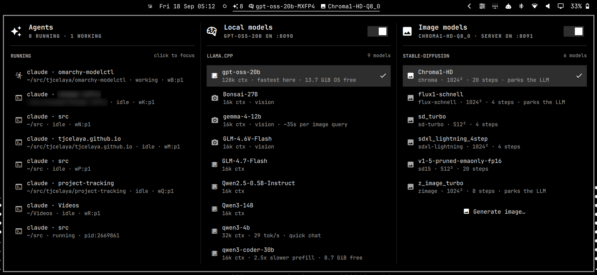
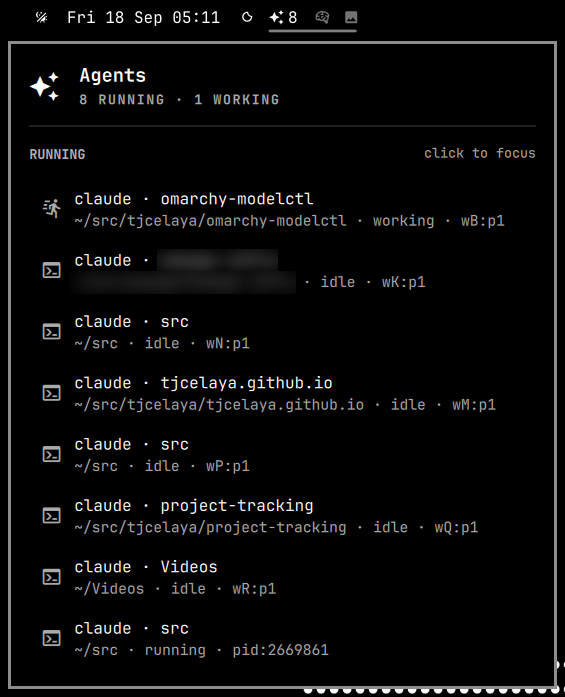
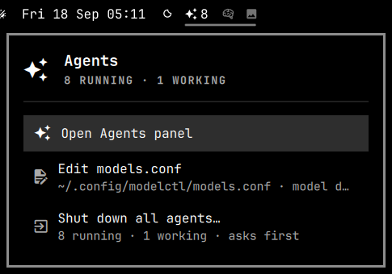
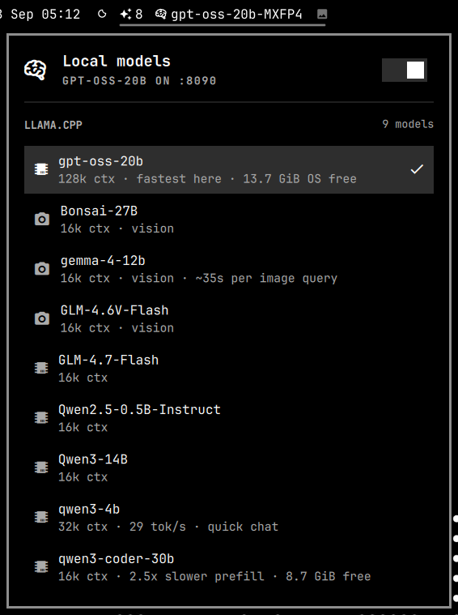
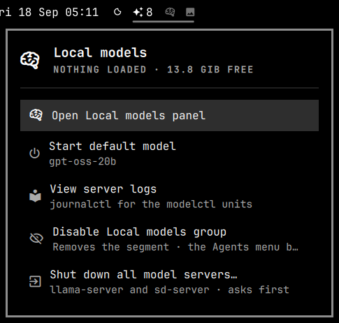
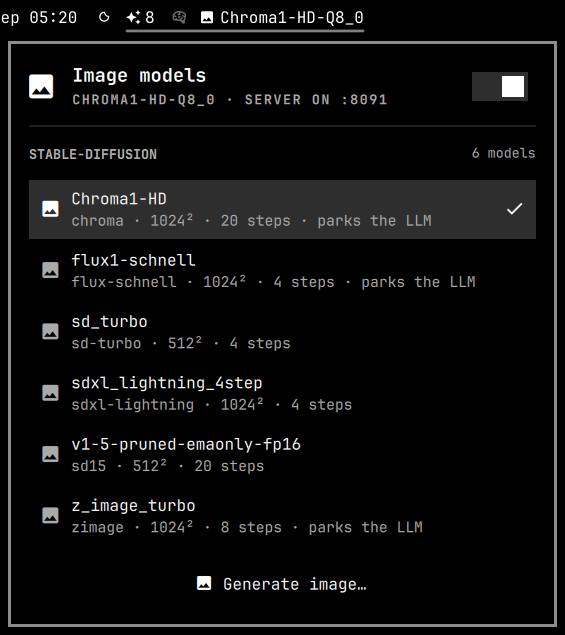
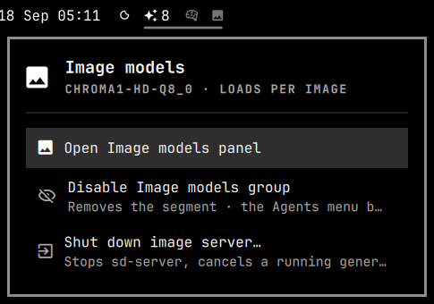
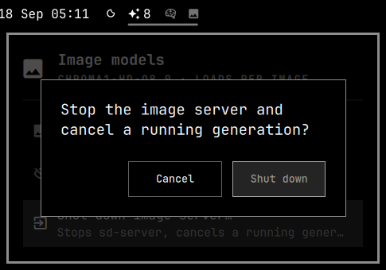

# modelctl

An Omarchy bar plugin for local models and coding agents: three bar segments, each
with its own dropdown and action menu.

- **Agents** `󰙴` — every running coding agent, one click to focus it.
- **Local models** `󰧑` — start and stop `llama-server` on any GGUF you have.
- **Image models** `󰋩` — pick a stable-diffusion.cpp checkpoint, keep `sd-server`
  resident, generate from a prompt.
- **Left click** a segment for its dropdown, **middle click** for all groups side by
  side, **right click** for its action menu. Shut-down actions ask first.
- Show only the groups you use: the `order` setting lists them (`agents,model,image`).
  Leave one out and it has no segment.
- Nothing runs at boot. Nothing leaves the machine.

Everything in detail is in the manual: `man modelctl` after installing, or
[docs/MANUAL.md](docs/MANUAL.md).

## Install

    omarchy plugin add https://github.com/tjcelaya/omarchy-modelctl.git --enable
    ~/.config/omarchy/plugins/tjcelaya.modelctl/install.sh

Needs `llama-cpp` (`llama-server`) for local models, `stable-diffusion.cpp`
(`sd-cli`, `sd-server`) for images, and `herdr` for herdr-managed agents; each group
is optional. Configuration lives in `~/.config/modelctl/models.conf`, created from
`models.conf.example` on install; the Agents menu opens it in your editor. To remove:
`uninstall.sh` in the plugin folder, then `omarchy plugin remove tjcelaya.modelctl`.
Details: [Installation](docs/MANUAL.md#installation) ·
[Configuration](docs/MANUAL.md#configuration) · [Security](docs/MANUAL.md#security).

## Everything at once

Middle click any segment for one card with every shown group as its own scrolling
column. Keyboard: `h`/`l` cycle views, `j`/`k` scroll, `Esc` closes.
Details: [Dropdowns](docs/MANUAL.md#dropdowns) · [Keys](docs/MANUAL.md#keys).

## Agents

 

Every running agent with its directory and status; click to focus its herdr pane or
window. The Agents menu is the main menu: it re-enables a hidden group, opens
`models.conf`, and can shut down every agent after a confirmation.
Details: [Agents](docs/MANUAL.md#agents).

## Local models

 

The switch starts the default model; the list loads any GGUF found under your model
folders (LM Studio, llama.cpp, `~/models`, Ollama). The menu stops the server, shows
its logs, or hides the group.
Details: [Local models](docs/MANUAL.md#local-models) ·
[Configuration](docs/MANUAL.md#configuration).

## Image models

  

The switch keeps `sd-server` resident; the list selects the checkpoint the segment
generates with, and *Generate image…* prompts you. Output folder, steps and size are
set in `models.conf`; a dialog for them is planned.
Details: [Image models](docs/MANUAL.md#image-models) ·
[Image generation](docs/MANUAL.md#image-generation).

## Status

v0.1.1, works on one machine. Known gaps and the development loop are in the manual's
[Bugs](docs/MANUAL.md#bugs) and [Developing](docs/MANUAL.md#developing) sections;
`TUNING.md` explains how the example config values were measured.
